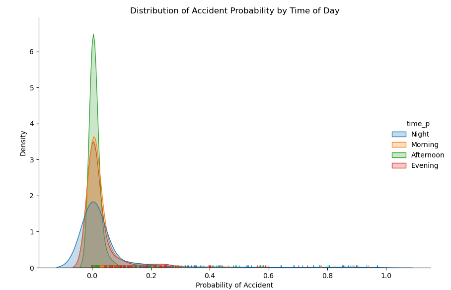
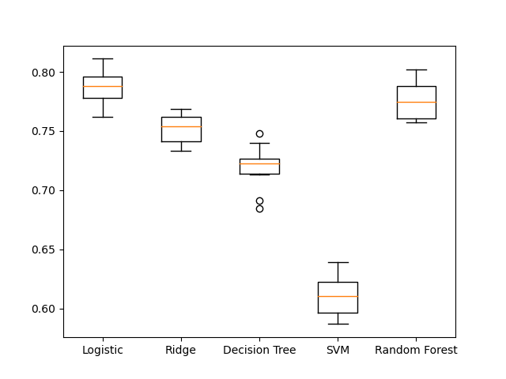
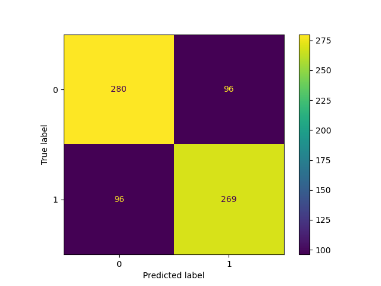

```{r setup, include=FALSE}
knitr::opts_chunk$set(echo = FALSE)

# Load dependencies 
library(reticulate) # For rendering Python code
library(htmltools)
```

## Abstract 

This article is inspired by the research project that aimed to tackle two main questions related to bicycle accidents in Berlin: injury severity prediction and accident likelihood prediction. For the first part, we built a model to predict the injury severity of bicycle accidents based on the circumstances of the accidents. Consequently, we dealt with imbalanced classification tasks that included cost-sensitive methods and multiple data sampling strategies, such as oversampling and undersampling. In the second phase of the project, we built a machine learning model to predict the probability of having a bicycle accident in Berlin based on location and time of the bicycle trip. This involved extensive data engineering tasks.

Results of the first phase of the research suggest that the information on the accident circumstances are not able to explain injury severity sufficiently. In the second phase of the project we demonstrated that the estimation of bicycle traffic and hence the prediction of bicycle accidents at a high temporal and spatial resolution is feasible. While our results should be interpreted with caution and against the backdrop of data limitations, the project is a successful primer on the topic that can be improved in granularity and precision of the predictions with more data, time and computational resources.

## Introduction 

Cycling is an extremely efficient mode of transport. It can be faster than motorised vehicles in rush hours, it is better for the environment, it decreases the pressure on public transportation and it improves the health of those who practise it. We also understand that safety is one of the main issues when discussing cycling as a mode of transport. A key challenge in the analysis of road safety policies is the lack of high-resolution temporal and spatial data that enables the evaluation of specific road safety measures.

Therefore, we developed this project aiming to predict the key drivers of bicycle accidents in Berlin using multiple approaches and data sets available. Our research project had essentially two main phases. For the first phase, we predicted the injury severity for each bicycle accident, classifying them between light injury and severe injury. In the second phase, we predicted the likelihood of a bicycle accident based on time and location.

We encountered a lot of challenges along the data preparation phase, as we had to collect and join multiple real-world data sources. A specific challenge was the unavailability of data on important confounding variables. With regards to phase one, we lacked data on those involved in the accidents, which weakened our injury severity predictions. Regarding phase two, we phased an issue of negative sampling which required plenty of data engineering to approximate total bicycle traffic and thereby accident likelihood. Regardless, we did achieve reasonable results, concluding that bicycle traffic is by far the strongest one. More importantly, we showcased that bicycle accident prediction is feasible at a granular level both temporally and spatially.

## Related Work 

The Ideation and Prototyping Lab of the Technologiestiftung Berlin has simulated bike flows in Berlin based on data from bike share providers. As opposed to their approach, we are fetching data solely from the nextbike API, as it is most widely used and the easiest to connect to. Furthermore, in their work, bike trips were simulated with the open street map directions engine, whereas we are using the Google Maps Directions API to get bicycling directions and recalibrate our estimations by the measuring points for bicycle traffic. Their project does not involve any accident prediction.

The award winning TU Berlin’s ongoing research project “SimRa” collects both data on bicycle accidents and near-accidents as well as bicycle traffic. They have developed a smartphone application that tracks participants bicycling routes and enables them to enter accident and near-accident data. A particular strength of their approach is that they also collect information on the cyclists. Given that the cycling behaviour differs and certainly affects accident probability, this is a very promising approach. A notable weakness of the approach is that the participants are selecting into the research project, which introduces a selection bias. According to the official accident statistics, most bicycle accidents happen in Mitte and in Kreuzberg-Friedrichshain, districts that are considered among the safest by SimRa.

## Proposed Method 

**Injury severity prediction:** Predicting the type of injury in each accident is essentially a classification predictive modelling problem. That is, a predictive modelling problem that involves assigning a class label to each observation. For our problem, an observation is a single accident occurrence and a class label is the type of injury in each accident. Moreover, this is a binary classification problem, as all examples of type of injury belong to one of two classes.

The original accidents datasets contain three distinct types of injury: 'death', 'heavy injury' and 'light injury'. The types of injury 'death' and 'heavy injury' were combined into a single injury type, 'severe injury'. This operation was necessary given the extremely imbalanced nature of the data. As there are significantly more occurrences of 'light injury' accidents, the other two classes had to be combined in order to minimise the effects of the uneven training dataset on the classification models. From a domain knowledge perspective, it was also reasonable to combine the occurrences of 'death' and 'heavy injury' accidents, as they are the ones which represent a higher safety concern.

```{r fig1, eval = TRUE, echo = FALSE, out.width = '100%', fig.cap = "Class imbalance"}

```

Stating the uneven nature of the classes, this is also an imbalanced classification problem, where the distribution of examples across the classes is not equal. Such classification is also known as rare event prediction \cite{brownlee2020imbalanced}. As severe injury bicycle accidents are indeed a rare occurrence in Berlin, the method serves the problem well. Without any further treatment, the distribution of our dataset is 13.49% to 86.51%, with the minority class being ‘severe injury’ and the majority class being 'light injury'.

In order to deal with the imbalanced classes, we employed three different approaches. One approach is to employ algorithms that support a cost-sensitive learning approach. While the exact implementation differs, the general approach is that misclassifications of the minority class are penalized heavier than from the majority class. The other two approaches involve the sampling of the training data. We employed two main sampling methods, over and undersampling. We first implemented a random undersampling and then chose to use the Synthetic Minority Oversampling Technique (SMOTE) for oversampling, which generates minority occurrences by randomly picking a point from the minority class and computing the k-nearest neighbours for this point. One of the advantages of oversampling is that there is no information loss with the technique [@brownlee2020imbalanced].

As for the models, seven algorithms are being used to train the data, being Logistic Regression; k-Nearest Neighbours; Gaussian NB; Decision Tree; Support Vector Machine; Random Forest and Multinomial NB. Trying different algorithms is also a method to cope with imbalanced classes. Decision trees often have a good performance [@brownlee2020imbalanced], and we see in our results that this is indeed the case for us.

**Accident likelihood prediction:** The prediction of the likelihood or probability of an accident can be done using multiple approaches. For this research project, we are framing it as a classification problem. More specifically, a binary classification problem. The two classes we are trying to predict are either dangerous or non-dangerous, each being a label for the combination of a specified location and time.

However, the originality of this research does not come necessarily from the classification models that were implemented, but from the data processing that was required in order to start training the models. Indeed, the data engineering component of the second phase of the project was the most time consuming and required a certain level of abstraction and creativity from the authors. 

For this classification problem, we used two principal predictors for each accident, being the location and the time of occurrence, which is given by hour, day of the week, month and year. The main datasets available, however, only gave us the positive sampling required for predicting the accidents probability. We still needed the negative sampling, and that was our most considerable obstacle.

During our research, we found two datasets that could aid us in tackling the negative sampling issue. The first one provided us with bicycle traffic data measured around 26 points spread across Berlin. The measured traffic data was stratified by each hour of each day, for the years of 2018, 2019 and 2020. The issue with this data was then not the time resolution, but the lack of spatial coverage. As the traffic was measured only across 26 specified points, a lot of the real bicycle traffic was missing from it. Additional data was then required at this point.

The second dataset used for the negative sampling issue was in fact generated specifically for this project. To start, data was retrieved from the API of nextbike, one of the leading rental bike providers in Berlin. The API supplied data from the nextbike rental bicycles registered in the city at the time of retrieval. By deploying a script fetching the API data each 15 minutes on PythonAnywhere, the location coordinates at a given time for each individual bicycle were obtained. 

The nextbike API data enabled us to simulate the traffic of rented nextbike’s bicycles in the city. We did this by sending the subsequent locations of each bicycle to the Google Maps Directions API. We implement this step over Google Maps rather than a different route finding engine, as Google Maps offers dedicated bicycle routing. The API response by Google Maps includes a polyline of the route - a geometric shape - that can be merged with intersecting geometries, like for instance the shapefiles of road segments or districts of Berlin. By doing this for an extended period of time, it is possible to simulate bicycle traffic of rental bikes at a high resolution in terms of location and time.

To get an estimate of the real bicycle traffic, we leveraged the measured bicycle traffic from the 26 measurement points available. By comparing the number of nextbike bicycle traffic along the road segment of the measuring point with the measured bicycle traffic, we were able to compute a scaling factor for each measuring point. We then equally extrapolated time trends from the measured bicycle traffic over month and time of the day at each measuring point. Both the time trends and the scaling factor were then applied to the simulated bicycle traffic at the closest location geometry, imputing bicycle traffic at each location for the relevant time periods. While this methodology introduced a number of additional assumptions on the relationship between measured and simulated rental bicycle traffic, it provided us with a high resolution estimate of bicycle traffic in Berlin, mitigating the negative sampling concern.

In order to combine both positive and negative samples and calculate the probability of an accident, we assigned both samples to two levels of aggregation of location data. The first one was road segment data, containing all 42.568 road segments in Berlin. The second level of aggregation data was divided per district, containing all 96 districts in the city in the form of a shapefile. The later level of location aggregation was the one used to train the classification models. The steps used in the data processing stage are simplified in the figure below:

```{r fig2, eval = TRUE, echo = FALSE, out.width = '100%', fig.cap = "Data processing"}
knitr::include_graphics("figures/flowchart.jpg")
```

Apart from feeding the models, the data processing steps provided us with some good understanding of the data, as seen in the two figures below, showing the number of nextbike trips per administrative area and the distribution of accident probability by time of the day.

```{r fig3, eval = TRUE, echo = FALSE, out.width = '100%', fig.cap = "Districts by count"}

```

```{r fig4, eval = TRUE, echo = FALSE, out.width = '100%', fig.cap = "Distribution of accident probabilities by period of day"}

```

As for the models, we employed algorithms that can be applied for balanced binary classification tasks, as by construction our classes are evenly balanced. The labels were given to a combination of location and time for each new instance of bike trip.

The models used to train the data were Logistic Regression, Ridge Classifier, Decision Tree, Support Vector Machine and Random Forest. As for the predictors, apart from district, month and time of the day, we also used the area of each district and the simulated nextbike traffic. A Grid Search was implemented for parameter optimization of the Decision Tree Classifier and Confusion Matrix was used to measure the performance of the classifier.

## Experiments 

**Injury severity prediction:** We chose to employ Receiver Operating Characteristic (ROC) Area Under the Curve (AUC) as an evaluation metric for this experiment. As a ranking metric, ROC is more concerned with the classifier’s ability to separate classes and has no bias toward models that perform well on the majority class at the expense of the minority class [@brownlee2020imbalanced]. To evaluate the performance of the different models and configurations, we used a repeated stratified K-fold cross-validation.

The seven methods used presented widely distinctive performances across the 3 employed approaches chosen to deal with the class imbalance. Generally, the models trained on SMOTE data appear to outperform the others. The best performing models were Random Forest, Support Vector Machine and Decision Tree. Logistic Regression, K-Nearest-Neighbour, Gaussian NB and Multinomial NB had poorer performances.

The results for this experiment were not as good as we expected. Given the breadth of information on the circumstances of the accident, it appears as though the features can not extensively explain injury severity. One factor is certainly that injury severity is not simply a function of the circumstances of the accident, but may be also explained to a large extent by other characteristics, such as the particularities of the people involved in each accident.

**Accident likelihood prediction:** We chose to employ a number of different evaluation methods. At first, we ran a repeated stratified cross validation with 5 folds and 2 repeats for each of the models, comparing their accuracy. We chose accuracy as the first evaluation metric, as the classification is perfectly balanced.

```{r fig5, eval = TRUE, echo = FALSE, out.width = '100%', fig.cap = "Cross-validated models by accuracy"}

```

We ended up picking the decision tree, as it performed similarly good as the other algorithms and has inherent advantages with respect to the explainability. We then performed a grid search over the parameters of the decision tree classifier to optimise the hyperparameter tuning of the model. 

After training the decision tree model, the classifier achieved a test set accuracy of 74.1%, and notably a precision and recall score of 73.7%. The resulting confusion matrix is plotted below. The scores show that the classifier did not overfit the training data, which is a common problem with decision trees.

```{r fig6, eval = TRUE, echo = FALSE, out.width = '100%', fig.cap = "Confusion Matrix"}

```

## Analysis 

**Accident likelihood prediction:** Looking into the predictors, it becomes very evident that the measured bicycle traffic is by far the strongest predictor of bicycle accidents, followed by the area and the night-period of time dummy variable. As expected, generally, lower traffic volumes are associated with higher road safety. Interestingly, ‘night’ appears to predict a lower accident risk. Possibly this is because of less traffic of other road participants at that time of the day. The second most important feature, district area size (FLAECHE HA) tends to predict higher accident probabilities, which is also counter intuitive. We believe this is due to a sampling error introduced by the nextbike data, which has a low traffic coverage in those areas, and therefore under-reports the denominator of the probability.

```{r fig7, eval = TRUE, echo = FALSE, out.width = '100%', fig.cap = "Feature Importance"}
knitr::include_graphics("figures/feature_importance.png")
```

Our priority for this particular classification task was the explainability of the model. In accordance with our motivation, the model results should be interpretable and communicated easily. This is why we only implemented a Logistic Regression, a Ridge classifier and a Decision Tree. To enable a comparison to more complicated models, we also trained a Support Vector Machine and a Random Forest Classifier. From the start, we had a strong preference for a Decision Tree, as it is particularly suited for explaining the interaction of predictors.

## Conclusions

Our project has tackled two main questions related to bicycle accidents in Berlin: first, we built a model to predict the injury severity of bicycle accidents based on the circumstances of the accidents. While the trained model did not yield very good predictions, we learned more about dealing with imbalanced classification tasks, at the preprocessing and sampling stage, the model selection and implementation stage, and finally the model evaluation stage. In the second phase of the project, we built a machine learning model to predict the probability of having a bicycle accident in Berlin based on location and time of the bicycle trip. This last phase required substantial data engineering to obtain adequate data for the classification task. Main leanings include the retrieval of data from APIs, the online deployment of Python scripts and working with spatial data. With regards to machine learning, we improved our understanding of the required workflow and delved further into model evaluation and tree-based models.

A primary limitation of the later phase is the data quality. Not only did we not acquire the exact required data for our intended purposes, but there were also various preprocessing steps that introduced strong additional assumptions on the data. Nevertheless, we are confident that our results show the feasibility of spatially and temporally high resolution bike traffic estimation as well as accident prediction based on the bike share provider data. This is why we believe further research should take the limitations regarding the data quality as a starting point and dedicate more time and resources into building a dataset that is both temporally and spatially more granular. Finally, further research should also attempt to take into account detailed information on bicycle-relevant road characteristics, such as bicycle lanes, and also characteristics of those involved in each accident. 

## Acknowledgments 

For the data preparation steps, we used code from the Technologiestiftung's bike-share flows in Berlin analysis [@Technologiestiftung]. Specifically, we adapted parts of their nextbike API script.